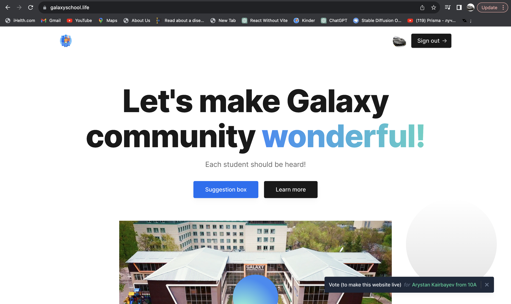
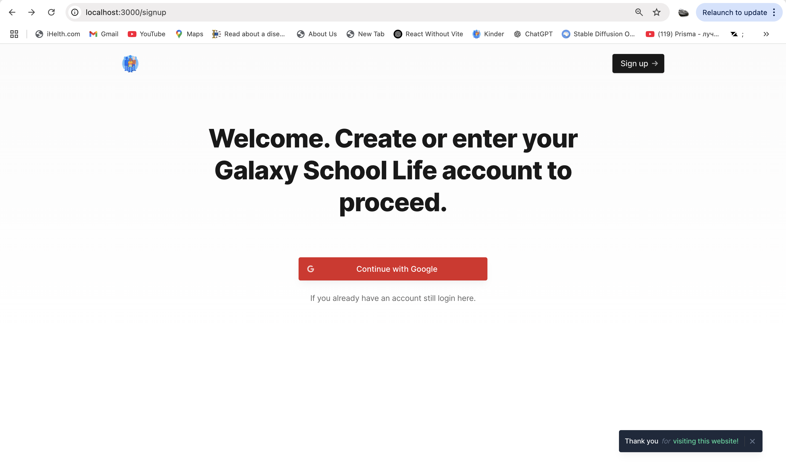
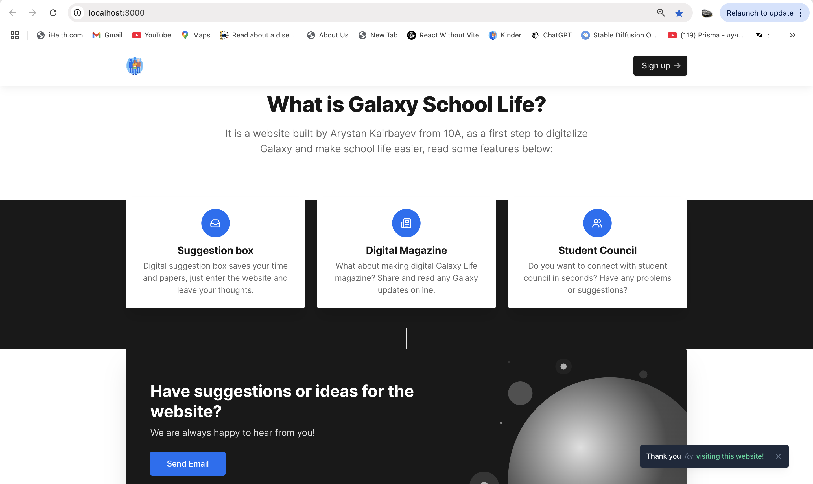
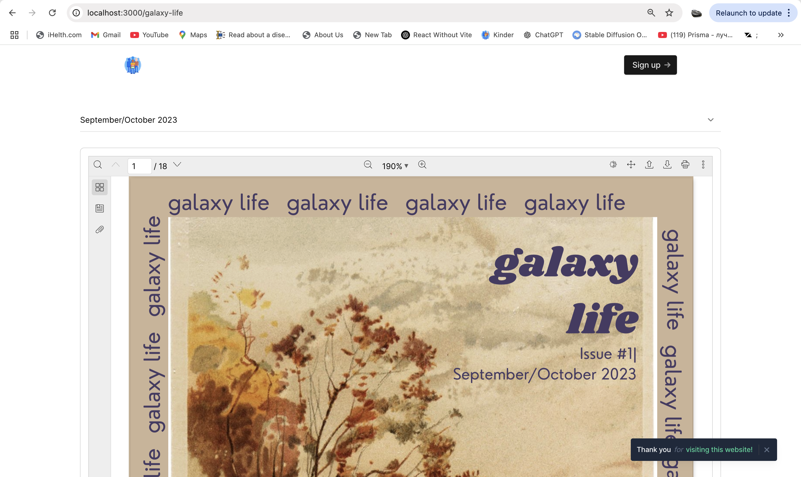

# GalaxySchool.life 🚀

A Next‑JS & TypeScript web app built to streamline the high‑school experience—born from my time as Student President. This platform empowers students to voice opinions, track suggestions, rate ideas, and stay informed.

> ⚠️ **Note**: This project was developed in just **2 days** and wasn't designed to be the most polished or production-ready version. It was a functional prototype to quickly meet student needs and experiment with feedback systems.

--- 

## 📱 Demo Video

 

---

## 🎯 Why I Built This

During my term as Student Council President, I saw firsthand how hard it is to capture honest feedback from the student body. **GalaxySchool.life** was created to:

- Provide an **anonymous suggestions box** where every student can contribute and vote.
- Offer **personalized accounts** so each student can engage meaningfully.
- Deliver up-to-date **school news** via regularly published digital newspapers.
- Bridge communication between students and administration effectively.

---

## 🧰 Tech Stack

- **Frontend + API**: [Next.js](https://nextjs.org) with **TypeScript** for type-safe and full-stack web development.
- **Authentication**: Google OAuth for secure, easy login.
- **Database**: PostgreSQL managed through **Prisma ORM**.
- **Backend**: Next.js API Routes handling secure data operations.
- **Styling/UI**: Tailwind

---

## ⚙️ Core Features

1. **🗳️ Suggestions Box**
   - Anonymously submit ideas.
   - View, rate, and discuss suggestions.
   
2. **🔐 User Authentication**
   - Students sign in securely using Google.
   - Personalized dashboards and interaction history.

3. **📰 School News**
   - Regularly updated newspaper-style feed.
   - Admin console for posting, editing, and scheduling updates.

4. **📊 Rating System**
   - Upvote/downvote to highlight popular ideas.
   - Sort or filter suggestions by score or date.

5. **🛠️ Admin Controls**
   - Dashboard for council or teachers.
   - Full management of students, suggestions, and publications.

---

## 📸 Screenshots

  

  

---